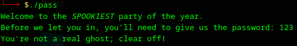
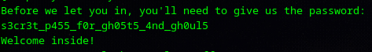
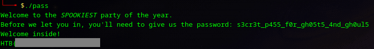

# SpookyPass - Writeup

**Platform:** *Hack The Box*

**Category:** *reversing*

**Difficulty:** *very easy*

**Link:** https://app.hackthebox.com/challenges/SpookyPass

## Solution

At the beginning I tried to start the program to understand its execution flow:

The program asked me for password. I started by using `strings` command to look for any readable content. The `strings` utility extracts sequences of printable characters from a binary, usually from sections like `.data` and `.rodata`. Among the output,  I found a string that looked like a password:

So, I entered this string as the password and got the flag:

