# Cap - Writeup

**Platform:** *Hack The Box*

**OS:** *Linux*

**Difficulty:** *easy*

**Link:** https://app.hackthebox.com/machines/Cap


## Description

Cap is an easy difficulty Linux machine running an HTTP server that performs administrative functions including performing network captures. Improper controls result in Insecure Direct Object Reference (IDOR) giving access to another user's capture. The capture contains plaintext credentials and can be used to gain foothold. A Linux capability is then leveraged to escalate to root.

## Solution

### Enumeration

I started with port scanning using `sudo nmap -sC -sV 10.10.10.245`

```
PORT   STATE SERVICE VERSION
21/tcp open  ftp     vsftpd 3.0.3
22/tcp open  ssh     OpenSSH 8.2p1 Ubuntu 4ubuntu0.2 (Ubuntu Linux; protocol 2.0)
| ssh-hostkey: 
|   3072 fa:80:a9:b2:ca:3b:88:69:a4:28:9e:39:0d:27:d5:75 (RSA)
|   256 96:d8:f8:e3:e8:f7:71:36:c5:49:d5:9d:b6:a4:c9:0c (ECDSA)
|_  256 3f:d0:ff:91:eb:3b:f6:e1:9f:2e:8d:de:b3:de:b2:18 (ED25519)
80/tcp open  http    gunicorn
|_http-title: Security Dashboard
| fingerprint-strings: 
|   FourOhFourRequest: 
|     HTTP/1.0 404 NOT FOUND
|     Server: gunicorn
|     Date: Mon, 19 May 2025 19:26:07 GMT
|     Connection: close
|     Content-Type: text/html; charset=utf-8
|     Content-Length: 232
|     <!DOCTYPE HTML PUBLIC "-//W3C//DTD HTML 3.2 Final//EN">
|     <title>404 Not Found</title>
|     <h1>Not Found</h1>
|     <p>The requested URL was not found on the server. If you entered the URL manually please check your spelling and try again.</p>
|   GetRequest: 
|     HTTP/1.0 200 OK
|     Server: gunicorn
|     Date: Mon, 19 May 2025 19:26:02 GMT
|     Connection: close
|     Content-Type: text/html; charset=utf-8
|     Content-Length: 19386
|     <!DOCTYPE html>
|     <html class="no-js" lang="en">
|     <head>
|     <meta charset="utf-8">
|     <meta http-equiv="x-ua-compatible" content="ie=edge">
|     <title>Security Dashboard</title>
|     <meta name="viewport" content="width=device-width, initial-scale=1">
|     <link rel="shortcut icon" type="image/png" href="/static/images/icon/favicon.ico">
|     <link rel="stylesheet" href="/static/css/bootstrap.min.css">
|     <link rel="stylesheet" href="/static/css/font-awesome.min.css">
|     <link rel="stylesheet" href="/static/css/themify-icons.css">
|     <link rel="stylesheet" href="/static/css/metisMenu.css">
|     <link rel="stylesheet" href="/static/css/owl.carousel.min.css">
|     <link rel="stylesheet" href="/static/css/slicknav.min.css">
|     <!-- amchar
|   HTTPOptions: 
|     HTTP/1.0 200 OK
|     Server: gunicorn
|     Date: Mon, 19 May 2025 19:26:02 GMT
|     Connection: close
|     Content-Type: text/html; charset=utf-8
|     Allow: HEAD, GET, OPTIONS
|     Content-Length: 0
|   RTSPRequest: 
|     HTTP/1.1 400 Bad Request
|     Connection: close
|     Content-Type: text/html
|     Content-Length: 196
|     <html>
|     <head>
|     <title>Bad Request</title>
|     </head>
|     <body>
|     <h1><p>Bad Request</p></h1>
|     Invalid HTTP Version &#x27;Invalid HTTP Version: &#x27;RTSP/1.0&#x27;&#x27;
|     </body>
|_    </html>
|_http-server-header: gunicorn
```

I found 3 open ports. I noticed that guest access via FTP was not allowed.
Also, there is a website on port 80 with no login that gives access to network security panel:

<p align="center">
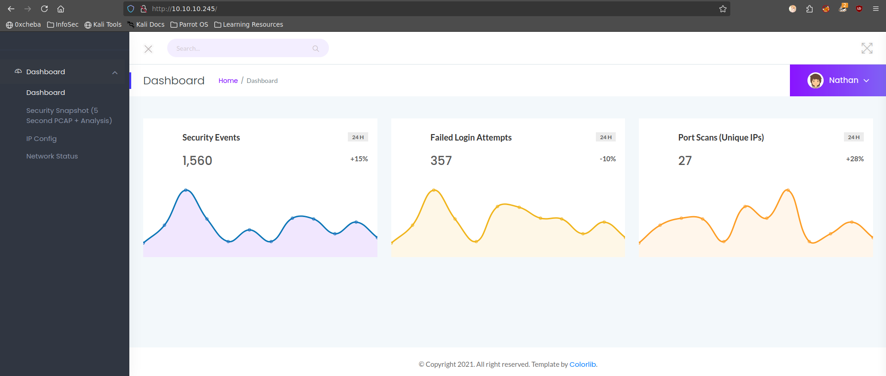
</p>

There, I found "Security snapshots" tab. This tab contains network traffic snapshots (.pcap files) that I could download, but it was empty:

<p align="center">
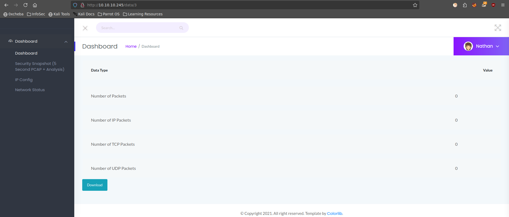
</p>

In the URL I found that the snapshot I see has number 3, so I tried exploiting the server using an **IDOR** vulnerability, and it worked. So, I iterated other snapshot IDs to find anything useful and found the snapshot at /data/0:

<p align="center">

</p>

Then, I downloaded it and analyzed it using **Wireshark**. This file was not big, so I found useful information fast:

<p align="center">
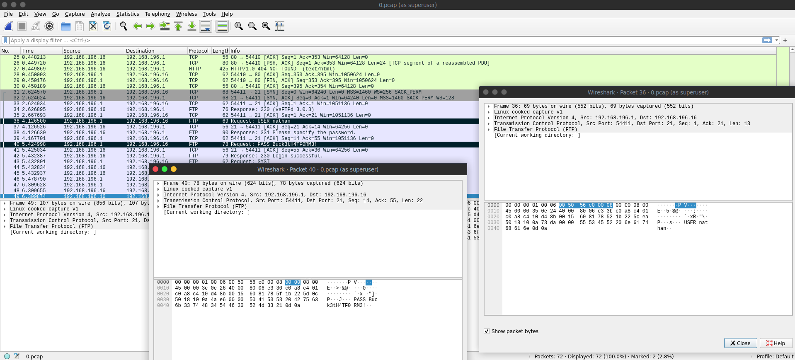
</p>

### First access

There were user credentials in FTP traffic dump. I used these credentials and connected to the server via FTP:

<p align="center">
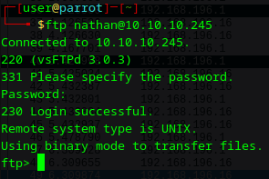
</p>

The user flag was located in nathan's home directory:

<p align="center">
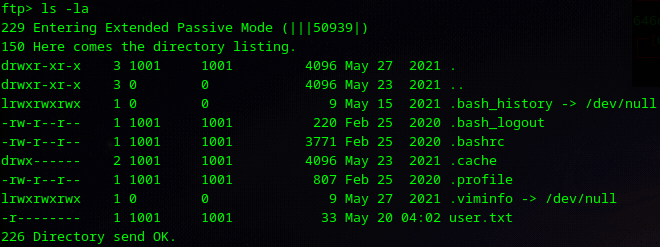
</p>
<p align="center">
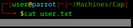
</p>

### Privilege escalation

Next, I tried to use this credentials to login via SSH and I succeeded. then, I looked for a way to escalate privileges to root and after some time spent on it I used `getcap -r / 2>/dev/null` and found interesting capabilities that `python3.8` binary has:

<p align="center">
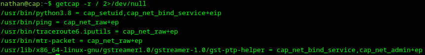
</p>

`python3.8` binary has **cap_setuid** capability, which allows a binary to change its process *UID*. That means, that I could start this binary's process with my *UID* and then change it to **root UID (UID 0)**. I exploited it by running the following script:

<p align="center">
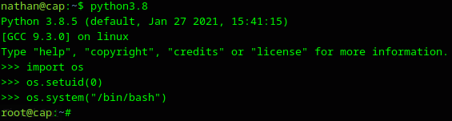
</p>

Then I went to /root directory to find root flag:

<p align="center">
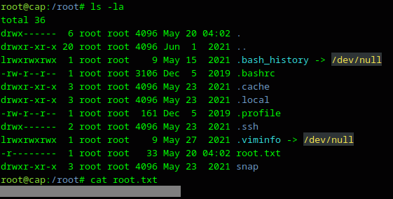
</p>


## Other ways

This system is old, that's why there were more vulnerabilities that could be exploited to get root. To discover if there are any additional vulnerabilities I used [linPEAS](https://github.com/peass-ng/PEASS-ng/blob/master/linPEAS/README.md) script and I found some of them:

<p align="center">
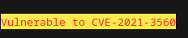
</p>

This [vulnerability](https://nvd.nist.gov/vuln/detail/CVE-2021-3560) lies in the fact that when an unprivileged user invokes a sensitive D-Bus method (e.g., using `dbus-send`) and interrupts the execution mid-way (e.g., by sending a `kill` signal), the request is already being processed while the permission check has not yet completed. This creates a race condition. As a result, when the program attempts to verify the user's UID, it may incorrectly interpret the request as coming from UID 0 (root).
I manually checked if this system is vulnerable:

<p align="center">
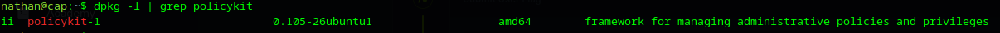
</p>
<p align="center">
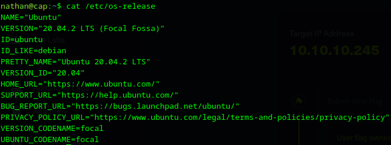
</p>

Based on the version, the system should have been vulnerable, but after several thousands tries manually and with different scripts ([1](https://github.com/secnigma/CVE-2021-3560-Polkit-Privilege-Esclation), [2](https://www.exploit-db.com/exploits/50011) and my own bash script) I did not gain the root access with this vulnerability and I did not find the reason why.