# Lame — Writeup

**Platform:** *Hack The Box*

**OS:** *Linux*

**Difficulty:** *easy*

**Link:** https://app.hackthebox.com/machines/Lame


## Description

Lame is an easy Linux machine, requiring only one exploit to obtain root access. It was the first machine published on Hack The Box and was often the first machine for new users prior to its retirement.

## Solution

### Enumreation

First, I scanned the target host with `sudo nmap -sC 10.10.10.3`

```
PORT    STATE SERVICE
21/tcp  open  ftp
|_ftp-anon: Anonymous FTP login allowed (FTP code 230)
| ftp-syst: 
|   STAT: 
| FTP server status:
|      Connected to 10.10.14.132
|      Logged in as ftp
|      TYPE: ASCII
|      No session bandwidth limit
|      Session timeout in seconds is 300
|      Control connection is plain text
|      Data connections will be plain text
|      vsFTPd 2.3.4 - secure, fast, stable
|_End of status
22/tcp  open  ssh
| ssh-hostkey: 
|   1024 60:0f:cf:e1:c0:5f:6a:74:d6:90:24:fa:c4:d5:6c:cd (DSA)
|_  2048 56:56:24:0f:21:1d:de:a7:2b:ae:61:b1:24:3d:e8:f3 (RSA)
139/tcp open  netbios-ssn
445/tcp open  microsoft-ds

Host script results:
| smb-security-mode: 
|   account_used: guest
|   authentication_level: user
|   challenge_response: supported
|_  message_signing: disabled (dangerous, but default)
| smb-os-discovery: 
|   OS: Unix (Samba 3.0.20-Debian)
|   Computer name: lame
|   NetBIOS computer name: 
|   Domain name: hackthebox.gr
|   FQDN: lame.hackthebox.gr
|_  System time: 2025-05-14T13:31:18-04:00
|_smb2-time: Protocol negotiation failed (SMB2)
|_clock-skew: mean: 2h00m36s, deviation: 2h49m43s, median: 35s

```
Here I noticed that both FTP and SMB allowed guest logins.
So, I tried to login to FTP to find any interesting files:

<p align="center">
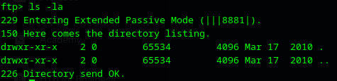
</p>

However, there were no files at all.
That's why I tried to enumerate shares with `smbclient -L 10.10.10.3`

<p align="center">
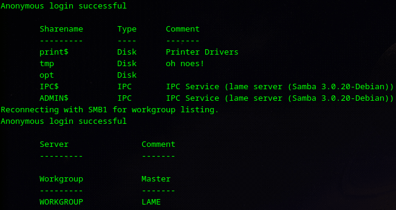
</p>

The only share available via guest login was `tmp`. But there are no any interesting files:

<p align="center">
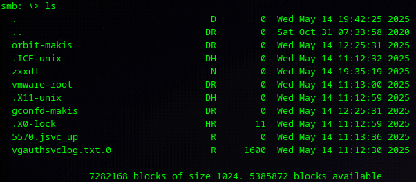
</p>

### Gaining access

Next, I checked whether any of the running service were vulnerable. So, I checked the vsFTPd 2.3.4 first. There is a Metasploit module available:

<p align="center">
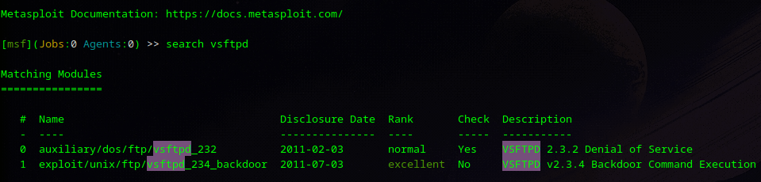
</p>

But it didn't work:

<p align="center">
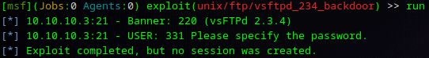
</p>

Then, I tried to check if Samba 3.0.20-Debian is vulnerable. Found the Metasploit module for this:

<p align="center">
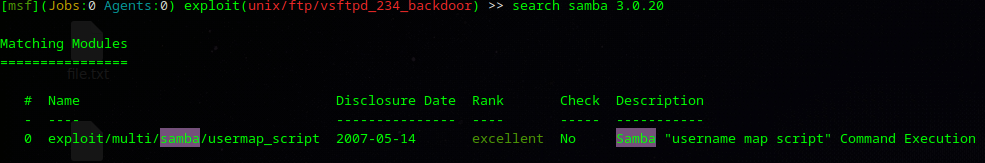
</p>

This time, the exploit succeeded:

<p align="center">
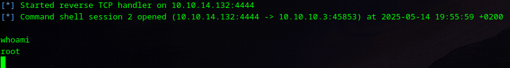
</p>

At the end I found user and root flags:

<p align="center">
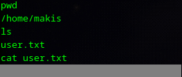
</p>
<p align="center">
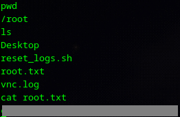
</p>


## Vulnerability breakdown

This vulnerability exists only in samba versions between **3.0.0 and 3.0.25rc3 (inclusive)** with `username map script` option enabled in conf file and tracked as [CVE 2007-2447](https://nvd.nist.gov/vuln/detail/CVE-2007-2447). This option allows administrator to bind names to login with samba with accounts in system. For example, the one who is logged with username "admin" will be logged in as root.
The old version of code didn't sanitize the username input:

<p align="center">
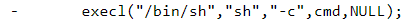
</p>

As a result, an unauthenticated user could access the target system via Command injection using \`\` in username (-U flag) to execute any command:

<p align="center">
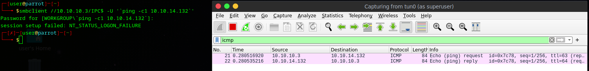
</p>

To fix this problem developers added sanitization function, that escapes special characters:

<p align="center">
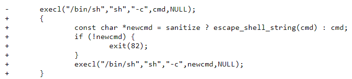
</p>
