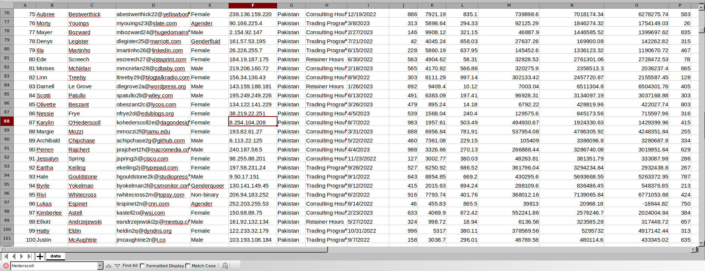

# Lockpick — Writeup

**Platform:** *Hack The Box*

**Category:** *Malware analysis*

**Difficulty:** *easy*

**Link:** https://app.hackthebox.com/sherlocks/Lockpick


## Scenario

Forela needs your help! A whole portion of our UNIX servers have been hit with what we think is ransomware. We are refusing to pay the attackers and need you to find a way to recover the files provided. **Warning** This is a warning that this Sherlock includes software that is going to interact with your computer and files. This software has been intentionally included for educational purposes and is NOT intended to be executed or used otherwise. Always handle such files in isolated, controlled, and secure environments. Once the Sherlock zip has been unzipped, you will find a DANGER.txt file. Please read this to proceed.

## Malware description

- **Searches for the `/forela-criticaldata` directory.**
	- Enumerates its contents.
- **XOR-encrypts all files with the following extensions:**
	- `.txt`, `.sql`, `.pdf`, `.docx`, `.xlsx`, `.csv`, `.json`, and `.xml`.
- **For each encrypted file, creates a .txt file with instructions on how to contact the attacker and recover the encrypted data.**
	-  Deletes the original files.

## Challenge Questions & Answers

1. **Please confirm the encryption key string utilised for the encryption of the files provided?**

	The encryption key is located in the `main function`:
	
	<p align="center">
	
	</p>

2. **We have recently recieved an email from [wbevansn1@cocolog-nifty.com](mailto:wbevansn1@cocolog-nifty.com) demanding to know the first and last name we have him registered as. They believe they made a mistake in the application process. Please confirm the first and last name of this applicant.**

	This information can be found inside one of the encrypted files. Previously, I checked whether the malware could harm my system and found nothing dangerous. Also, XOR encryption is symmetric — encoding the same data again with the same key will decrypt it. That's why I started the malware binary again:

	<p align="center">
	
	</p>

3. **What is the MAC address and serial number of the laptop assigned to Hart Manifould?**

	The MAC address can be found in `it_assets.xml` file:

	<p align="center">
	
	</p>

4. **What is the email address of the attacker?**

	There are `.txt` files created for each encrypted file. The attacker's email address is inside:

	<p align="center">
	
	</p>

5. **City of London Police have suspiciouns of some insider trading taking part within our trading organization. Please confirm the email address of the person with the highest profit percentage in a single trade alongside the profit percentage.**

	To find the answer I wrote a simple script:

	```python
	import json
	
	file = './forela-criticaldata/trading-firebase_bkup.json'
	field = 'profit_percentage'
	max_per = 0
	
	with open(file, 'r', encoding='utf-8') as f:
		data = json.load(f)
	
	for key, entries in data.items():
		if entries[field] > max_per:
			max_per = entries[field]
			
	for key, entries in data.items():
		if max_per == entries.get(field):
			print(json.dumps(entries))
	```

	I got an answer, but it turned out to be incorrect:

	<p align="center">
	
	</p>
	So, I tried to find the answer manually with the user's email:

	<p align="center">
	
	</p>

6. **Our E-Discovery team would like to confirm the IP address detailed in the Sales Forecast log for a user who is suspected of sharing their account with a colleague. Please confirm the IP address for Karylin O'Hederscoll.**

	<p align="center">
	
	</p>

7. **Which of the following file extensions is not targeted by the malware? `.txt, .sql,.ppt, .pdf, .docx, .xlsx, .csv, .json, .xml`**

	 The answer can be found in the disassembled malware binary:

	<p align="center">
	
	</p>

8. **We need to confirm the integrity of the files once decrypted. Please confirm the MD5 hash of the applicants DB.**

	<p align="center">
	
	</p>

9. **We need to confirm the integrity of the files once decrypted. Please confirm the MD5 hash of the trading backup.**

	<p align="center">
	
	</p>

10. **We need to confirm the integrity of the files once decrypted. Please confirm the MD5 hash of the complaints file.**

	<p align="center">
	
	</p>

## Additional information

For more details, you can visit the following page: https://any.run/report/19ad47d6e0a43e77e1d23534404bd7bb7f0742b961ef2b219160c9ef3945572d/31c57bca-1125-417a-9b46-fedfd9f118c5