# Loggy — Witeup

**Platform:** *Hack The Box*

**Category:** *Malware analysis*

**Difficulty:** *easy*

**Link:** https://app.hackthebox.com/sherlocks/Loggy

## Scenario

Janice from accounting is beside herself! She was contacted by the SOC to tell her that her work credentials were found on the dark web by the threat intel team. We managed to recover some files from her machine and sent them to the our REM analyst.

## Malware description

- **The malware logs all keystrokes and periodically captures screenshots.**
	- Keystrokes are written to `keylog.txt` file in the malware's working directory.
	- Screenshots are saved as `.png` images in the same directory.
- **All malware-created files, as well as any files whose names begins with "screenshot", are exfiltrated to the attacker's FTP server at `gotthem[.]htb:21`.**

# Challenge Questions & Answers

1. **What is the SHA-256 hash of this malware binary?**

	The SHA-256 can be easily found using [VirusTotal](https://www.virustotal.com/gui/file/6acd8a362def62034cbd011e6632ba5120196e2011c83dc6045fcb28b590457c):
	
	

	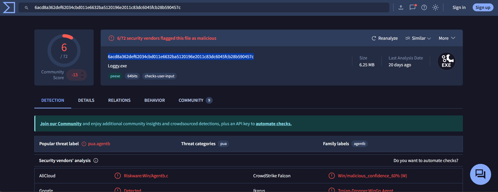
	

	
2. **What programming language (and version) is this malware written in?**

	The programming language and version can be identified using DIE:
	
	

	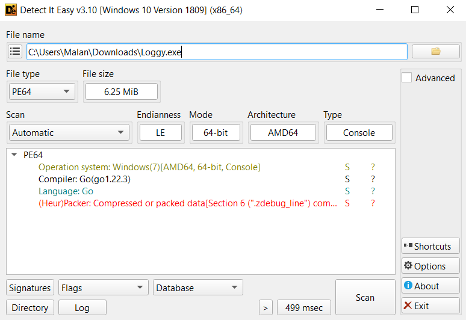
	

3. **There are multiple GitHub repos referenced in the static strings. Which GitHub repo would be most likely suggest the ability of this malware to exfiltrate data?**

	There are many strings in the binary. I searched for GitHub-related strings in the binary:

	

	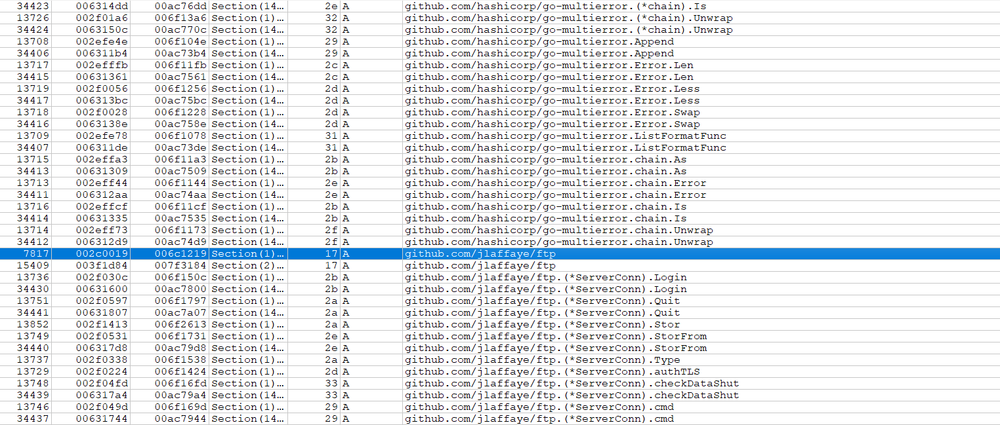
	

4. **What dependency, expressed as a GitHub repo, supports Janice’s assertion that she thought she downloaded something that can just take screenshots?**

	This dependency also appears in the binary's strings:

	

	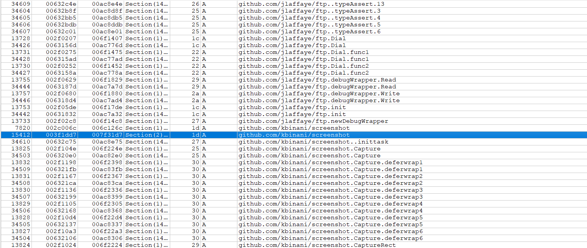
	

5. **Which function call suggests that the malware produces a file after execution?**

	To identify functions responsible for writing files, I looked for relevant Windows API calls. The binary uses `WriteFile`, which suggests file creation:

	

	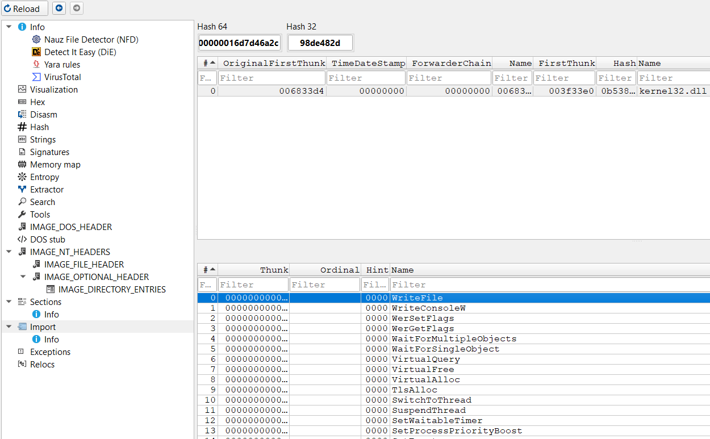
	

6. **You observe that the malware is exfiltrating data over FTP. What is the domain it is exfiltrating data to?**

	The domain used for exfiltration was found in the decompiled code:

	

	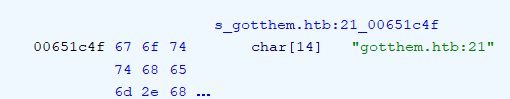
	

7. **What are the threat actor’s credentials?**

	The threat actor’s credentials are hardcoded in the disassembled code:

	

	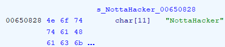
	

	

	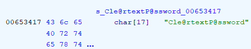
	

	

	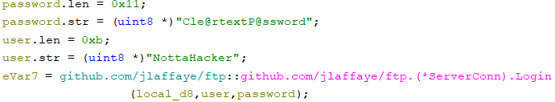
	

8. **What file keeps getting written to disk?**

	The malware repeatedly writes to a file named `keylog.txt`:

	

	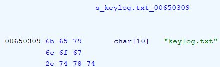
	

	

	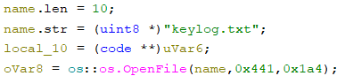
	

9. **When Janice changed her password, this was captured in a file. What is Janice's username and password?**

	A plaintext log file was provided with the binary. Janice's username and password were captured there:

	

	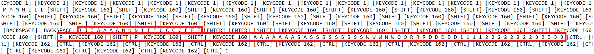
	

10. **What app did Janice have open the last time she ran the "screenshot app"?**

	 Among the included `.png` screenshots, one reveals the last open app:

	

	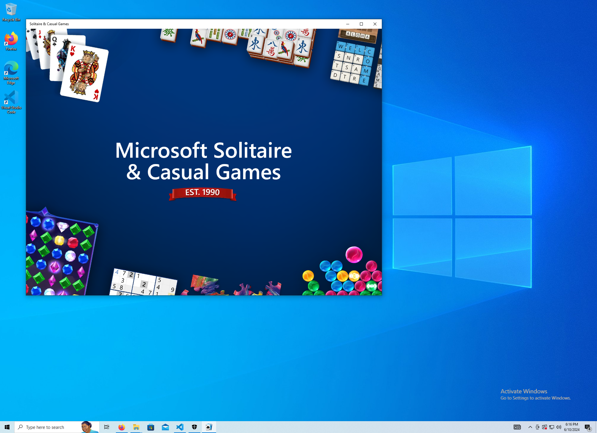
	

# Additional information

For more details you can visit the following page: https://any.run/report/6acd8a362def62034cbd011e6632ba5120196e2011c83dc6045fcb28b590457c/0d9375af-6201-43ab-a490-4a7a89eefb94