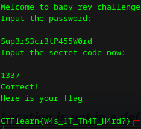

# babyrev - writeup

**Platform:** *crackmes.one*

**Difficulty:** *1.2*

**Link:** https://www.crackmes.one/crackme/6784f8a84d850ac5f7dc5173

## Description (from crackme's author)

You’ve just run across an old program, seemingly innocent at first. It asks for a password, and if you enter it correctly, you might think you've won. But there's more lurking beneath the surface. Something about this challenge doesn’t add up. The program not only demands the correct password, but also a secret code—one that isn’t easily discovered. Is it hidden within the code? Or perhaps something you’ll have to figure out for yourself?

## Solution

First, I tried to gather some information using the `strings` utility:

Here we can see several strings from the binary, including a password and a fake flag.

In the program's main function, we can easily find a section that compares the user input with a hexadecimal value. If the value is incorrect, the program displays an error message:

I converted this hexadecimal value into decimal and got `1337`. I entered it into the program — and it worked:

